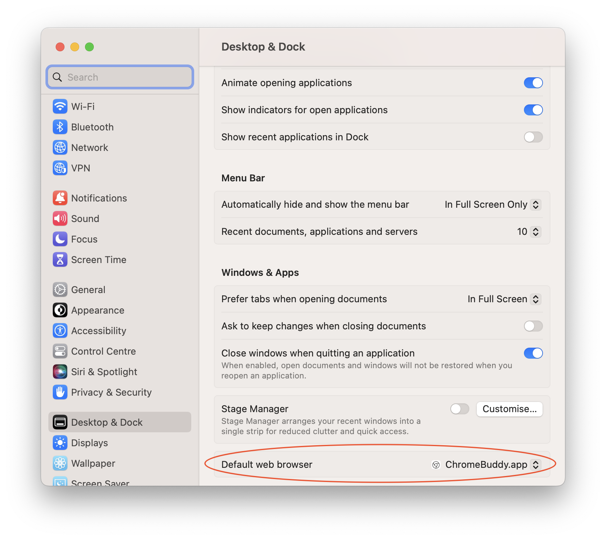
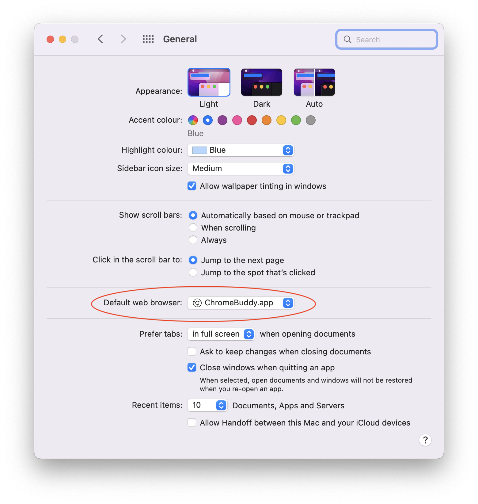

<p align="center">
  
<br>
<br>
</p>

# ChromeBuddy

Opens external links in the foremost Chrome window, no matter is it regular or incognito profile.

# Motivation

This app is a way to address chrome behaviour change introduced in version 68. Original behaviour on Macs was opening external links in foremost(i.e. last used) window. Starting from Chrome 68 such behvaiour was updated open external links in last used regular profile as said by chromium team to address some securty concerns. The problem is that such concerns are highly related to user behaviour and workflows and it can lead to security issues for user in the opposite direction if the user expects external links are opened in foremost window. See the discussion on the chromium tracker for details: https://bugs.chromium.org/p/chromium/issues/detail?id=757253

# Caveats

While ChromeBuddy is code-signed, it is an adhoc signature that is not verified by apple and the app is not notarized by Apple since it is required paid Apple Developer account. Lack of notarization lead to quarantine when downloaded from the internet. MacOS does not allow to run such apps by double click, instead it can be run by right-clicking on the app and choosing "*Open*" option, it will raise a dialog to open the app and allow it to run permanently.

# Installation

1. Copy app from downloaded DMG to `/Application` 
2. Go to `/Application`  folder in Finder
3. Do right-click on the app and choose "*Open*" option
4. In the raised dialog choose "*Open*" to bypass gatekeeper and allow app to runs permanently, see [Caveats](#Caveats) for details
5. Go to [Usage](#Usage) to configure ChromeBuddy as a default browser

# Usage

Choose ChromeBuddy as a defult browser in System Settings.

#### For MacOS 13 Ventura and higher

* Go to System Settings → Desktop & Dock → Default web browser 
* Choose ChromeBuddy


#### For MacOS 12 Monterey and lower

* Go to System Settings → General → Default web browser 
* Choose ChromeBuddy



# Building from sources
Given that current directory is the root of this repository in terminal:

```shell
make build sign
```

Find built app in `./build` directory


# Changelog

### v1.0.0

* Initial release

# License
MIT